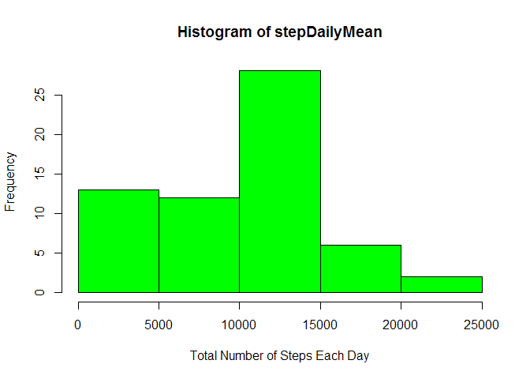
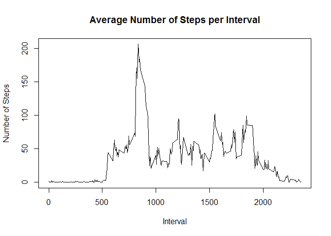

# Reproducible Research: Peer Assessment 1


## Loading and preprocessing the data

```r
        activityData <- read.csv(unzip(zipfile='activity.zip'))
```


## What is mean total number of steps taken per day?

```r
        library(ggplot2)
```

```
## Warning: package 'ggplot2' was built under R version 3.3.1
```

```r
        stepDailyMean <- tapply(activityData$steps, activityData$date, sum, na.rm=TRUE)
        hist(stepDailyMean, col='green', xlab='Total Number of Steps Each Day')
```

<!-- -->

```r
        dailyMean <- mean(stepDailyMean, na.rm = TRUE)
        dailyMedian <- median(stepDailyMean, na.rm = TRUE)
```

The daily mean of steps taken is 9354.2295082 and the daily median is 10395.  


## What is the average daily activity pattern?

```r
        intervalAverages <- aggregate(x=list(steps=activityData$steps), 
                                      by=list(interval=activityData$interval),
                                      FUN=mean, na.rm=TRUE)
                
        plot(intervalAverages$interval,intervalAverages$steps, 
             type="l", 
             xlab="Interval", 
             ylab="Number of Steps",
             main="Average Number of Steps per Interval")
```

<!-- -->

```r
        maxAverage <- intervalAverages[which.max(intervalAverages$steps),]
```

The 5 minute interval with the maximum average of steps takenacross the dataset is interval 835 with 206.1698113 steps.   


## Imputing missing values

```r
        missingValues <- sum(is.na(activityData))
```

Total number of missing vlues in the dataset is 2304.  

## Are there differences in activity patterns between weekdays and weekends?

