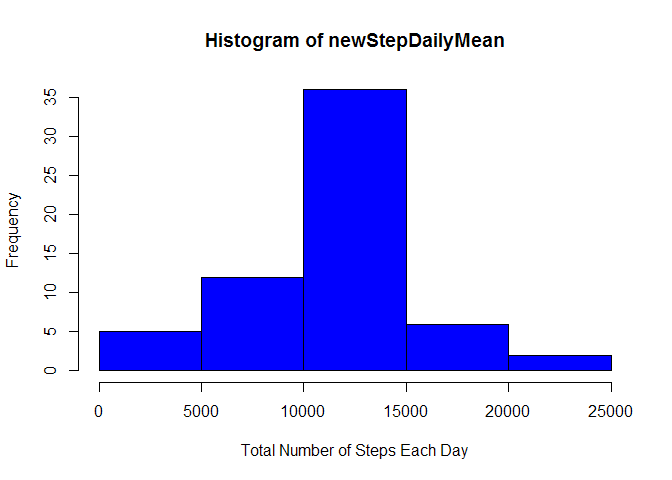
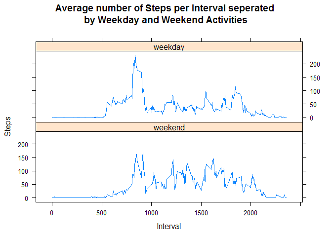

# Reproducible Research: Peer Assessment 1


## Loading and preprocessing the data

```r
        activityData <- read.csv(unzip(zipfile='activity.zip'))
```


## What is mean total number of steps taken per day?

```r
        library(ggplot2)
```

```
## Warning: package 'ggplot2' was built under R version 3.3.1
```

```r
        stepDailyMean <- tapply(activityData$steps, activityData$date, sum, na.rm=TRUE)
        hist(stepDailyMean, col='green', xlab='Total Number of Steps Each Day')
```

<!-- -->

```r
        dailyMean <- mean(stepDailyMean, na.rm = TRUE)
        dailyMedian <- median(stepDailyMean, na.rm = TRUE)
```
  
The daily mean of steps taken is 9354.2295082 and the daily median is 10395.  


## What is the average daily activity pattern?

```r
        intervalAverages <- aggregate(x=list(steps=activityData$steps), 
                                      by=list(interval=activityData$interval),
                                      FUN=mean, na.rm=TRUE)
                
        plot(intervalAverages$interval,intervalAverages$steps, 
             type="l", 
             xlab="Interval", 
             ylab="Number of Steps",
             main="Average Number of Steps per Interval")
```

<!-- -->

```r
        maxAverage <- intervalAverages[which.max(intervalAverages$steps),]
```
  
The 5 minute interval with the maximum average of steps takenacross the dataset is interval 835 with 206.1698113 steps.   


## Imputing missing values

```r
        missingValues <- sum(is.na(activityData))
```
  
Total number of missing vlues in the dataset is 2304.  


```r
        newActivityData <- activityData 

        for (i in 1:nrow(newActivityData)) {
                if (is.na(newActivityData$steps[i])) {
                        newActivityData$steps[i] <- intervalAverages$steps[intervalAverages$interval==newActivityData$interval[i]]
                }
        }
```
  
New dataset created to with missing step values replaced with the value from the repective mean of 5-minute interval.  
The new data set is called newActivityData.


```r
        newStepDailyMean <- tapply(newActivityData$steps, newActivityData$date, sum)
        hist(newStepDailyMean, col='blue', xlab='Total Number of Steps Each Day')
```

<!-- -->

```r
        newDailyMean <- mean(newStepDailyMean)
        newDailyMedian <- median(newStepDailyMean)
```
  
The daily mean for the new dataset without missing values is 1.0766189\times 10^{4} and the daily median for the new dataset is 1.0766189\times 10^{4}.  
The new mean and median values for the new dataset are higher than the mean and mediam from the orginal dataset as missing values have been replaced with the mean values of the respective interval mean.

## Are there differences in activity patterns between weekdays and weekends?

```r
        library(timeDate)
        
        newActivityData$DayOfWeek <- factor((isWeekday(newActivityData$date, wday=1:5)), 
                                            labels=c("weekend","weekday"))
```
### Plotting the results of weekday and weekend activities

```r
        library(lattice)
        
        newAverages <- aggregate(steps ~ interval + DayOfWeek, newActivityData, FUN=mean)
        
        xyplot(newAverages$steps ~ newAverages$interval|newAverages$DayOfWeek, 
               layout=c(1,2), 
               type="l",
               main="Average number of Steps per Interval seperated \nby Weekday and Weekend Activities",
               xlab="Interval", 
               ylab="Steps"
               )
```

<!-- -->
